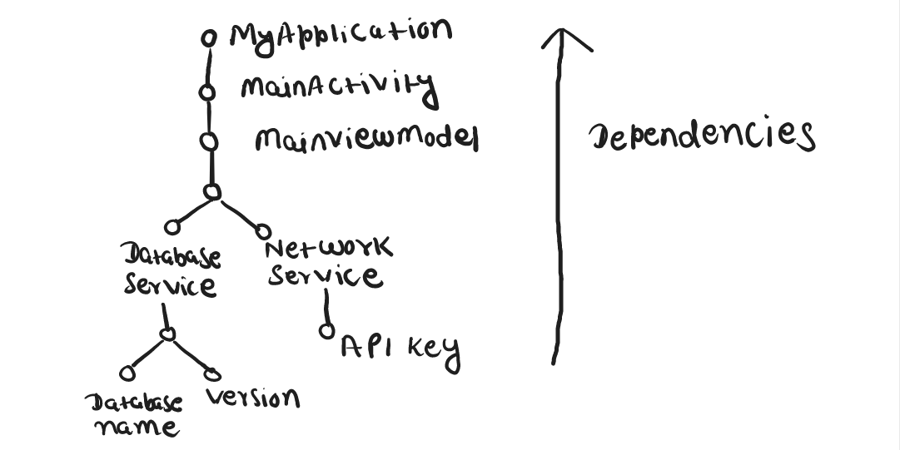
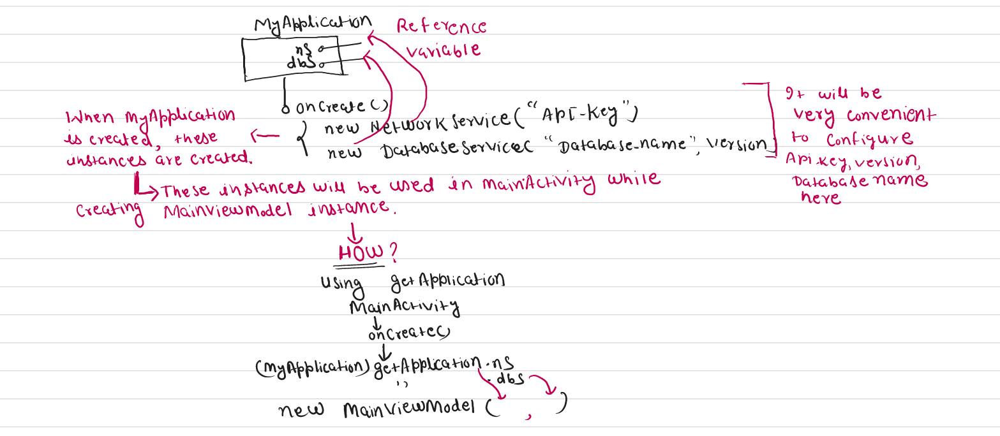
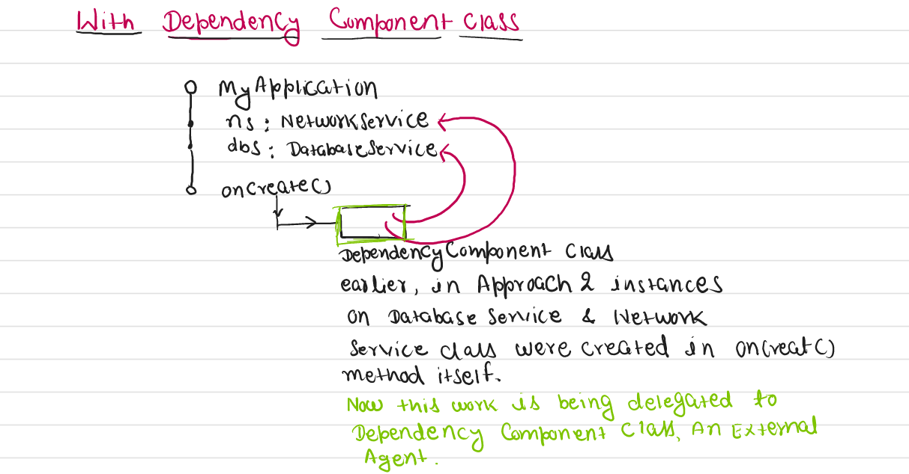
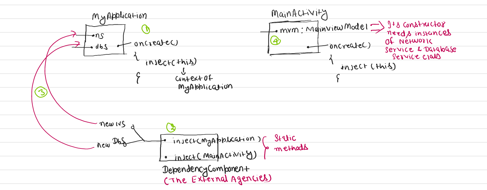

# Dependency Injection And Dagger

## What is Dependency Class and Dependency Injection?

### What is Dependency?
In very simple words, If class A needs instance of class B to function, then B is called a dependency class for class A.

### What is Dependency Injection?
Generally, instances of dependency classes are needed in dependent classes.

For example, if MainActivity has to update a list it may need to access Database and for that MainActivity will need an instance of Database class. So basically MainActivity is a Dependent class that is dependent on Database class, a dependency class. Usually at small scale developers take an approach where they write code in such way that instance of Dependency class is created inside the Dependent Classes and it works fine. 

But at large scale project it can be very inefficient in terms of configurability, testing, memory and performance. (We will see this in Design Approach 1). Using Dependency Injection concept we delegate task of generating and managing instances of Dependency Classes to an External Agent like Dagger, HILT or KOIN.

We will not see Dagger first. We will try to break down the problem to understand and will explore different solutions and approaches for providing instances of Dependency Classes to Dependent Classes. This way we can understand the need and evolution of Dependency Injection frameworks like Dagger, HILT, KOIN.

First, let us see the following Graph:
**Picture 1**


In this context and project, MyApplication, the MainActivity class depends on the MainViewModel class, which in turn depends on the DatabaseService and NetworkService classes. The DatabaseService class requires a database name and version number, and the NetworkService class requires an API key. These classes are known as dependency classes because they are required by the dependent classes that depend on them.

There are several approaches to providing instances of these dependency classes to the dependent classes that need them. These approaches include:

    Approach 1: The dependent class creates its own instances of the dependency classes it requires.

    Approach 2: Inversion of Control (IOC), where the instances of the dependency classes are created first 
                and then provided to the dependent classes.
    Approach 3: An external agent, known as a Dependency Component class, creates the instances of the 
                dependency classes.
    Approach 4: Using Dagger, a framework for dependency injection.

Each of these approaches has its own pros and cons, and we will examine them in more detail to determine the best approach for our project.

## Design Approach 1 (Without Dagger Or Any Dependency Injection Framework)
See the following Graph:
**Picture 2**


In this first design approach we will discuss is creating instances of dependencies directly within the dependent class. This is a common approach that is often taken without realizing it. However, this approach has several drawbacks.

    1. Configurability: With this approach it is very hard to configure it at times. What do I mean? let's 
       see the graph. The database name, version, api key have been hardcoded when  the instance of them was
       created by Dependent classes. Now if we have different DB and resaource for development stage and production
       stage then to change them at production it will be very hard. Without going down all the hierarchy it 
       will not be possible.
    2. Expensiveness: Some instances are very expensive in terms of memory, for exapmle Database Service and
       Network Service. We would like to make as less instances as possible for them. Also, we would like to
       create them only when it needeed and we would like to preserve them as long as possible. In this approaach
       it will not be possible. If there are so many instances in the heap that have not been used then Garbage 
       collector will hae to run very frequently. Running GC frequently is bad for app performance as it runs on 
       MainThread and if it run on MainThread frequently, it will hinder the Mainthread other important tasks, 
       such as rendering the UI elements, navigation, data fetching and so on.
    3. Difficult To Test: (Will add more on this when I get more clarity)
    
I don't have experience with Testing so writing about this will not be very clear, though I have asked explred
and here is the answer.
    **Answer on how DI makes code more testable:**

    Dependency injection is a design pattern that allows a software component to receive its dependencies from
    an external source rather than creating them itself. This can make testing easier in several ways:

    Isolation of dependencies: By injecting dependencies into a class, rather than creating them within the 
    class, it becomes easier to isolate the class from its dependencies during testing. This allows you to 
    focus on testing the behavior of the class itself, rather than the behavior of its dependencies.

    Mocking of dependencies: During testing, you may want to use mock versions of certain dependencies in 
    order to test the behavior of your class under different conditions. Dependency injection makes it easier 
    to substitute mock versions of dependencies, because you can simply pass them in as arguments when creating 
    the class.

    Better test coverage: Dependency injection can make it easier to test a class in a variety of different 
    configurations, because you can easily switch out different implementations of dependencies. This can help 
    you achieve better test coverage and find potential issues earlier in the development process.

    Overall, dependency injection can help you create more maintainable and reliable tests by allowing you to 
    focus on testing the behavior of individual components in isolation, rather than the interactions between 
    components.

Now we will see how we try to solve these challenges with different approaches and ultimately with a DI framework, Dagger, at the end.
## Design Approach 2 (Without Dagger)
Let us improve our previous design approach 1, little bit to overcome some drawbacks. In design approach 1, code was hard to configure because instances of dependency classes were being created from top to down and it was hard to change API name, database name or version. But what if we decouple and break this hierarchy. See the below picture.
**Picture 3**


In this approach, first we will create string objects for API key, database name and an int variable for version. Similarly instances of dependency classes will be created first in Bottom up approach. See fig 2.
**This is called IOC, Inversion Of Control**. 

Points to be noted.
```
   1. Here instances of dependency classes are not being created inside the dependent class. But
      are being created first outside then it is being provided to Dependent Classes. This is the rule
      of IOC.
   
   What problem does it solve?
   -> Now it will be easy to change database name, api key, version from outside without having to
   getting into the mess of the hierarchy.
   
   But, still 
   - Instances are not being handled in a very smart way.
   - Database service and Network Service class are expensive classes and in this approach will be destroyed
   and recreated again and again with Activity cycle. Also there can be many different instances for these classes.

``` 
**How this approach will be implemented in the project?**
See the picture below:
**Picture 4**


Conclusion and Drawbacks:
1. We have created instances of expensive dependency classes, Database Service and Network Service class, in MyApplication class. So with MainActivity they will not get destroyed and system and GC will save a lot of work.
2. But still, MainViewModel class, a dependency class, is being created inside its Dependent class that is against its IOC rule. Also even Database Service and Network Service class are not totally being created independently.

## Design Approach 3 (Still without Dagger, but with an External Agent)

In this approach we are creating a DependencyComponent Class that will take the responsibility of creating instances of Dependency Classes. 

That is, in approach 2 we were creating instances of Database Service and NetworkService class in MyApplication's onCreate()(see Fig 4), here the instances will be created inside DependencyComponent class. This concept is very close to Dagger or other Dependency Injection Frameworks.

**NOTE: The current stage of project has code for this approach. CHECK CODE AT THE COMMIT WITH TAG: STAGE 1**
See the graph below to understand this:
**Picture 5**


In the above picture, instance is being created and being assigned to reference variable. This is called **Field Injection**.

How everything is working, we can see this in below picture.


DependencyComponent class has two static methods called inject(). In MyApplication's onCreate() method inject() is invoked that will create and assigns the instances of NetworkService and Database Service class.

When the MainActivity invokes inject(this) method, using 'this' it can get the instance of MyApplication class and using that instance it can also access instances of Database Service and Network Service class to pass into MainViewModel constructor in order to create instance of MainViewModel. **This is called Constructor Injection**.

Project code at STAGE 1:
### DependencyComponent class code
```
public class DependencyComponent {

    public static void inject(MyApplication application) {
        application.networkService = new NetworkService(application, "SOME_API_KEY:abc");
        application.databaseService = new DatabaseService(application, "dummy_db:xyz", 1);
    }

    public static void inject(MainActivity activity) {
        MyApplication app = (MyApplication) activity.getApplication();
        activity.viewModel = new MainViewModel(app.databaseService, app.networkService);
    }
}

```

### MyApplication class code
```
public class MyApplication extends Application {
    public DatabaseService databaseService;
    public NetworkService networkService;

    @Override
    public void onCreate() {
        super.onCreate();
        DependencyComponent.inject(this);


    }
}


```

### MainActivity class code

```
public class MainActivity extends AppCompatActivity {

    public MainViewModel viewModel;

    @Override
    protected void onCreate(Bundle savedInstanceState) {
        super.onCreate(savedInstanceState);
        setContentView(R.layout.activity_main);

        DependencyComponent.inject(this);

        TextView tvData = findViewById(R.id.tvData);
        tvData.setText(viewModel.getSomeData());
    }
}

```

**A note about MyApplication And Application class**
* MyApplication class here is a custom Application class. It is generally instantiated by AndroidManifests' --> <application> <\application>
* Application class is a base class that serves as an entry point for our Application and contains Global State in Android. It is responsible for creating and initiating the activity class. Application class also provides access to resources, settings, other components of the application.
* Global Application State refers to any data( e.g, user pref, settings, app data, cached data) tht needs to be available for all the components of your application.

This approach is very close to the approach taken by DI frameworks. Now we will learn about Dagger.

There have been other DI frameworks before Dagger. Like, GUICE, JAVA Reflection and more.

**GUICE vs JAVA REFLECTION vs DAGGER vs KOIN**
```
Guice, Java Reflection, Dagger, and KOIN are all tools that can be used for dependency injection in 
Java and Android applications. Dependency injection is a technique for managing the dependencies 
(i.e., objects that a class depends on) of a class by externalizing them, so that they can be changed 
or replaced without modifying the class itself.

Here is a brief overview of each of these tools:

    GUICE is a lightweight dependency injection framework for Java developed by Google. It uses Java 
    annotations to define dependencies and provides support for binding, scoping, and injecting dependencies.
    It uses JAVA REFLECTION to inject object at RunTime.
    
             * What is JAVA REFLECTION?
             -> JAVA REFLECTION is a Java API that allows developers to inspect and modify the behavior of 
                Java programs at runtime. It can be used to implement dependency injection by creating 
                objects and setting their dependencies programmatically using reflection.
             
             * Drawbacks os using JAVA REFLECTION?
             -> Java Reflection can be SLOW as it injects objects at RunTime and for that it takes extra 
                time to analyze the code and injecting the object. And the performance may affect big time if
                the Reflection is called very frequently. It may make our app slow and in-performant.
             -> Also, as object creation is done at runtime, so it may be very difficult for us to check all
                the configuration we have made for object injection, whther they are right or wrong.

    DAGGER is a dependency injection framework for Android and Java developed by Square. It uses code generation
    to create the necessary injection code, which makes it faster and more efficient than other dependency 
    injection frameworks that rely on reflection.
             * Dagger uses Annotation Processing for generating the necessary code for object injection. 
             Everything
               what Java Reflection does at run time it does at build time/compile time other than the actual 
               Instance Creation. Dagger inspects, generates necessary code, creates a map of dependent and 
               dependency classes at build time/compile time but actually creates and injects instances at Runtime.
             

    KOIN is a dependency injection framework for Android and Kotlin developed by EkoLabs. It is lightweight and 
    easy to use, and it uses a DSL (domain-specific language) to define dependencies and provide support for injection.

In general, all of these tools can be used to implement dependency injection in Java and Android applications, 
and the choice of which one to use will depend on the specific needs and preferences of the developer.


```

## DAGGER 
Now we will start understanding how using a DI framework called Dagger we can solve many challenges that was bugging us when we were using the earlier approaches.
First we will see the architecture of Dagger. Then we will look into the implementation details. 

Generally there are 3 components of Dagger: **Dependency Consumer Class**, **Component Class**, and, **Module class**

The common work flow is like this: The Dependent class contacts the Component class and says that I need an instance of a Dependency Class.
Then Dependency component class actually contacts Module class. Module class actually creates and provides instances of the Dependency class.

## Initial Stage Of The Project
Here in the initial stage, the dependency tree is like: 
>>MyApplication --> MyActivity --> MainViewModel --> NetworkService,DatabaseService.

In this approach, the MyApplication class is using an external agent called the DependencyComponent class to create instances of the NetworkService and DatabaseService classes. These instance are provided to MainViewModel constructor to create MainViewModel instance, that has to be provided to the MainActivity. This approach is not using Dagger, but it is attempting to mimic the functionality of Dagger for creating dependency class instances.
   
## Getting Rid Of DependencyComponent Class And Introducing Dagger Framework
Using an external component like the DependencyComponent class can help us create and provide instances of our dependency classes, but it can be time-consuming to do so manually. To make this process more efficient, we can use a dependency injection framework like Dagger, Dagger-Hilt, or KOIN. These frameworks provide us with tools and mechanisms to manage and inject dependencies more efficiently and effectively.

We are going to use Dagger here. To use Dagger the first step is to add the following Dependencies.
 ```
  // Dependency injection
   
   implementation "com.google.dagger:dagger:2.21"
   
   annotationProcessor "com.google.dagger:dagger-compiler:2.21"
  ```


## Architecture Of DAGGER
