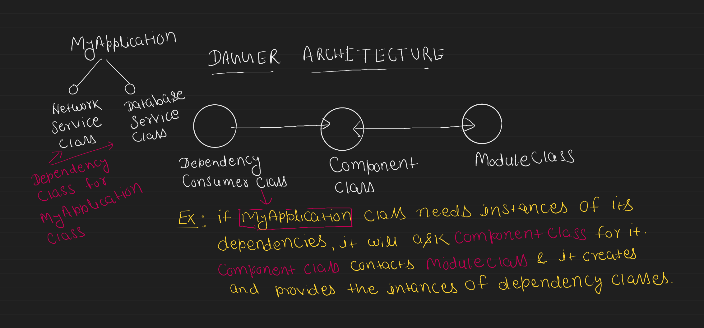

# Dependency Injection And Dagger

 ## What is Dependency Injection?
Let us see the following Graph:

In the context of the MyApplication project, the MainActivity class depends on the MainViewModel class, which in turn depends on the DatabaseService and NetworkService classes. The DatabaseService class requires a database name and version number, and the NetworkService class requires an API key. These classes are known as dependency classes because they are required by the dependent classes that depend on them.

There are several approaches to providing instances of these dependency classes to the dependent classes that need them. These approaches include:

    Approach 1: The dependent class creates its own instances of the dependency classes it requires.
    Approach 2: Inversion of Control (IOC), where the instances of the dependency classes are created first and then provided to the dependent classes.
    Approach 3: An external agent, known as a Dependency Component class, creates the instances of the dependency classes.
    Approach 4: Using Dagger, a framework for dependency injection.

Each of these approaches has its own pros and cons, and we will examine them in more detail to determine the best approach for our project.

  ## Initial Stage Of the Project
Here in the initial stage, the dependency tree is like: 
>>MyApplication --> MyActivity --> MainViewModel --> NetworkService,DatabaseService.
    
In this approach what we are doing is we are creating instances of NetworkService and DatabaseService class in the MyApplication
class but not exactly in the MyApplication class. It is actually delegating this work to an External Agent called 
DependencyComponent class. It has 2 inject methods that will create those instances including MainViewModel instance 
and provide it to MainActivity. This is not Dagger but it is trying to imitate functionality of Dagger for creating 
Dependency classes instances.
   
 ## Getting Rid Of DependencyComponent Class And Introducing Dagger Framework
  We have seen how using an External Component called DependencyComponent Class we can create and provide instances. But we 
  will use Dagger instead. Why? Providing instances of Dependency classes is a tedious work and to do this efficiently we are 
  provided with many Dependency Injection Frameworks like Dagger, Dagger-Hilt, KOIN and so on.

  We are going to use Dagger here. To use Dagger the first step is to add the following Dependencies.
  >>// Dependency injection
  > 
  > implementation "com.google.dagger:dagger:2.21"
  > 
  > annotationProcessor "com.google.dagger:dagger-compiler:2.21"
 ## Architecture Of DAGGER
  